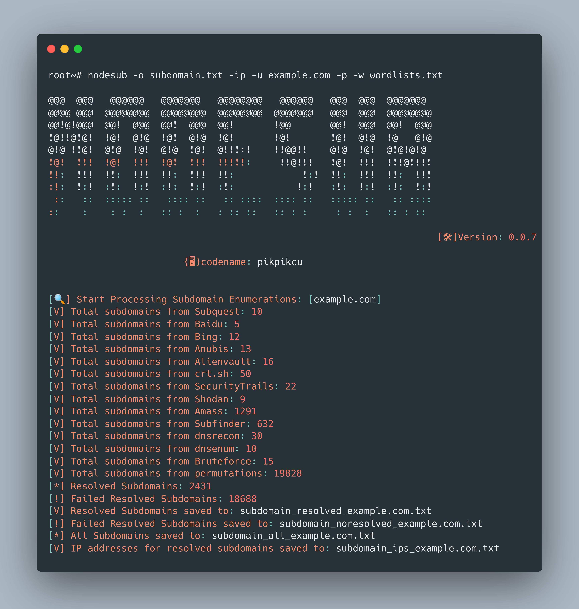

<h1 align="center">
  NODESUB
  <br>
</h1>

Nodesub is a command-line tool for finding subdomains in bug bounty programs. It supports various subdomain enumeration techniques and provides flexible options for customization.

# Features

<h1 align="left">
  </a>
  <br>
</h1>

## Installation

To install Nodesub, use the following command:

`npm install -g nodesub`

**NOTE:**

- Edit File `~/.config/nodesub/config.ini`

# Usage

```
nodesub -h
```

This will display help for the tool. Here are all the switches it supports.

```
Usage: nodesub [options]

Nodesub is a command-line tool for finding subdomains in bug bounty programs.

Options:
  -u, --url <domain>                     Main domain
  -l, --list <file>                      File with list of domains
  -dns, --dnsenum                        Enable DNS Enumeration (if you enable this the enumeration process will be slow)
  -rl, --rate-limit <limit>              Rate limit for DNS requests (requests per second) (default: "0")
  -ip, --ips                             Ekstrak IPs in Subdomain Resolved
  -wl, --wildcard                        Filter subdomains by wildcard DNS resolution Default:(False)
  -w, --wordlist <file>                  Wordlist file
  -r, --recursive                        Enable recursive subdomain enumeration
  -p, --permutations                     Enable subdomain permutations
  -re,--resolver <file>                  File with list of resolvers
  -pr, --proxy <proxy>                   Proxy URL
  -pa, --proxy-auth <username:password>  Proxy authentication credentials
  -s, --size <size>                      Max old space size heap Default:(10048 MB)
  -d, --debug                            Show DNS resolution details
  -v, --verbose                          Enable verbose output
  -o, --output <file>                    Output file
  -f, --format <format>                  Output file format (txt, json, csv, pdf) (default: "txt")
  -h, --help                             display help for command
```
## Examples

- Enumerate subdomains for a single domain:
  	`nodesub -u example.com`

- Enumerate subdomains for a list of domains from a file:
	`nodesub -l domains.txt`

- Enable recursive subdomain enumeration and output the results to a JSON file:
	`nodesub -u example.com -r -o output.json -f json`
